# 🤔 Decision Guide: Which Template Should I Use?

## Quick Decision Tree

```mermaid
flowchart TD
    Start([Need MongoDB?]) --> Q1{Do you need a<br/>production-ready setup<br/>quickly?}
    
    Q1 -->|Yes| Q2{Do you accept<br/>standard configuration?}
    Q1 -->|No| Q3{Do you have<br/>existing infrastructure?}
    
    Q2 -->|Yes| Golden[✅ Use Golden Path Template<br/>service-mongodb-golden-path-template]
    Q2 -->|No| Custom[⚙️ Use Individual Templates<br/>Customize each component]
    
    Q3 -->|Yes| Q4{Need fine control?}
    Q3 -->|No| Dev[💻 Just MongoDB for dev?]
    
    Q4 -->|Yes| Individual[🔧 Use Individual Templates<br/>service-mongodb-template<br/>service-cluster-template<br/>service-dns-template]
    Q4 -->|No| Golden
    
    Dev -->|Yes| MongoOnly[📦 Use MongoDB Template Only<br/>service-mongodb-template]
    
    style Golden fill:#90EE90
    style Individual fill:#FFE4B5
    style Custom fill:#FFE4B5
    style MongoOnly fill:#ADD8E6
```



## Detailed Comparison

| Aspect | 🚀 Golden Path | 🔧 Individual Templates |
|--------|---------------|------------------------|
| **Setup Time** | 5 minutes | 30-60 minutes |
| **Complexity** | Low - 3 parameters | High - 20+ parameters |
| **Customization** | Limited | Full control |
| **Best For** | Standard apps | Special requirements |
| **Infrastructure** | Complete stack | À la carte |
| **Cost** | Higher (full stack) | Variable |
| **Maintenance** | Simplified | More complex |

## Scenarios

### ✅ Choose Golden Path When:

#### Scenario 1: New Project
> "We're starting a new microservice and need a database"

**Why Golden Path?** Get everything configured correctly from day one.

#### Scenario 2: Standardization
> "We want all our MongoDB deployments to follow best practices"

**Why Golden Path?** Enforces organizational standards automatically.

#### Scenario 3: Time Pressure
> "We need this deployed by end of day"

**Why Golden Path?** Fastest path to production.

### 🔧 Choose Individual Templates When:

#### Scenario 1: Existing Infrastructure
> "We already have a Kubernetes cluster running"

**Why Individual?** Don't create duplicate infrastructure.

#### Scenario 2: Cost Optimization
> "We need to share clusters between services"

**Why Individual?** Fine-tune resource allocation.

#### Scenario 3: Special Requirements
> "We need MongoDB in a specific network configuration"

**Why Individual?** Full control over every parameter.

## Template Combinations

### Golden Path (All-in-One)
```
service-mongodb-golden-path-template
  ├── Creates Cluster
  ├── Creates DNS
  ├── Creates Firewall
  └── Creates MongoDB
```

### Custom Stack (Pick and Choose)
```
Option A: Full Control
  1. service-cluster-template
  2. service-firewall-template  
  3. service-dnsrecord-template
  4. service-mongodb-template

Option B: Shared Infrastructure
  1. Use existing cluster
  2. service-dnsrecord-template
  3. service-mongodb-template

Option C: Development Only
  1. service-mongodb-template (standalone)
```

## Cost Implications

### Golden Path Costs (Monthly)
- Cluster: $300-500
- MongoDB: $50-100
- DNS: $1
- **Total: ~$351-601/month**

### Individual Templates (Flexible)
- Shared Cluster: $0 (reuse existing)
- MongoDB: $50-100
- DNS: $1
- **Total: ~$51-101/month**

## Migration Paths

### From Individual → Golden Path
1. Not recommended (would duplicate infrastructure)
2. Better to stay with individual templates

### From Golden Path → Individual
1. Keep existing golden path deployment
2. Use individual templates for additions
3. Gradually migrate if needed

## Questions to Ask Yourself

1. **Do I need this running today?**
   - Yes → Golden Path
   - No → Either option

2. **Will this be production?**
   - Yes → Golden Path (unless special requirements)
   - No → Individual MongoDB template

3. **Do I have Kubernetes expertise?**
   - Yes → Either option
   - No → Golden Path

4. **Is this a proof of concept?**
   - Yes → Individual MongoDB only
   - No → Golden Path

5. **Do I need to integrate with existing systems?**
   - Yes → Individual templates
   - No → Golden Path

## Recommendation Matrix

| Your Situation | Recommended Template |
|---------------|---------------------|
| New to platform | Golden Path |
| Experienced platform user | Individual |
| Prototype/POC | MongoDB only |
| Production service | Golden Path |
| Microservice in existing cluster | Individual |
| Isolated workload | Golden Path |
| Cost-sensitive | Individual |
| Time-sensitive | Golden Path |

## Still Unsure?

**Default recommendation: Start with the Golden Path** 🚀

Why? 
- It's easier to start with best practices
- You can always customize later
- Less chance of configuration errors
- Faster time to value

## Need Help?

- Ask in [Discussions](https://github.com/orgs/open-service-portal/discussions)
- Check [Examples](https://github.com/open-service-portal/examples)
- Contact platform team in Slack: #platform-engineering