# 🚀 MongoDB Golden Path Template

> **The recommended way to provision production-ready MongoDB infrastructure with a single click**

## What is a Golden Path?

A **Golden Path** is an opinionated, well-architected solution that represents the best practice for a common use case. Instead of making developers choose between dozens of options and potentially making mistakes, the Golden Path provides a pre-validated, production-ready solution.

## 🎯 What This Template Does

With **one simple request**, this template automatically provisions:

### Complete Infrastructure Stack

```mermaid
graph TB
    subgraph "What You Get"
        MongoDB["🗄️ MongoDB Database<br/>Document Store"]
        Cluster["☸️ Kubernetes Cluster<br/>3 nodes, HA"]
        DNS["🌐 DNS Record<br/>Stable endpoint"]
        Network["🔒 Network Security<br/>Firewall rules"]
    end
    
    subgraph "How It's Connected"
        MongoDB --> Cluster
        DNS --> MongoDB
        Network --> Cluster
    end
    
    Developer["👩‍💻 Developer"] -->|"One Template"| MongoDB
    
    style MongoDB fill:#f9f,stroke:#333,stroke-width:4px
    style Developer fill:#bbf,stroke:#333,stroke-width:2px
```



## 🆚 Golden Path vs. Individual Components

### ❌ The Hard Way (Individual Components)

```bash
# Step 1: Create a cluster
backstage template:create service-cluster-template

# Step 2: Wait for cluster...
# Step 3: Create DNS
backstage template:create service-dnsrecord-template

# Step 4: Configure DNS to point to cluster...
# Step 5: Create firewall rules
backstage template:create service-firewall-template

# Step 6: Configure network policies...
# Step 7: Finally create MongoDB
backstage template:create service-mongodb-template

# Step 8: Wire everything together...
# Step 9: Hope it all works...
```

**Problems:**
- 🔴 7+ manual steps
- 🔴 Complex dependencies to manage
- 🔴 Easy to misconfigure
- 🔴 No guarantee components work together
- 🔴 Time consuming

### ✅ The Golden Path (This Template)

```bash
# Step 1: Create everything with proper configuration
backstage template:create service-mongodb-golden-path-template

# Done! ✨
```

**Benefits:**
- 🟢 1 step
- 🟢 Pre-validated configuration
- 🟢 Guaranteed compatibility
- 🟢 Production-ready defaults
- 🟢 5 minutes to production

## 📊 Architecture

### System Model in Backstage

```yaml
System: mongodb-stack
├── Resource: mongodb (depends on → cluster, dns)
├── Resource: cluster 
├── Resource: dns (depends on → cluster)
└── Resource: firewall (protects → cluster)
```

### Crossplane Composition

The template uses **Crossplane** to manage the infrastructure declaratively:

1. **MongoDB XRD** defines the API
2. **Composition** orchestrates the resource creation:
   - Creates Kubernetes cluster
   - Provisions MongoDB on the cluster
   - Sets up DNS records
   - Configures security rules
3. **Single Claim** triggers the entire stack

## 🚀 Quick Start

### Prerequisites

- Backstage instance with this template installed
- Crossplane installed in your cluster
- GitHub account for repository creation

### Usage

1. **In Backstage UI:**
   - Navigate to "Create Component"
   - Select "🚀 MongoDB Golden Path"
   - Fill in just 3 fields:
     - Stack name
     - Storage size
     - Team owner

2. **Apply Infrastructure:**
   ```bash
   kubectl apply -f https://github.com/open-service-portal/[your-repo]/example.yaml
   ```

3. **Get Connection String:**
   ```bash
   kubectl get mongodb [stack-name] -o jsonpath='{.status.connString}'
   ```

## 📈 Stacked Services Concept

This template demonstrates the **Stacked Services** pattern:

### Level 1: Base Infrastructure
- Kubernetes Cluster
- Network Security

### Level 2: Platform Services  
- DNS Management
- Service Discovery

### Level 3: Application Services
- MongoDB Database
- Connection Management

Each level depends on the one below, creating a stable, scalable stack.

## 🎯 When to Use This Template

### Use the Golden Path when:
- ✅ You need a production-ready MongoDB quickly
- ✅ You want best-practice configuration
- ✅ You prefer convention over configuration
- ✅ You're building a standard application

### Use Individual Templates when:
- ⚠️ You have specific infrastructure requirements
- ⚠️ You need custom networking setup
- ⚠️ You're integrating with existing infrastructure
- ⚠️ You need fine-grained control

## 📖 Backstage Concepts Used

### 1. **Software Templates**
- Defined in `template.yaml`
- Uses scaffolder actions to create resources
- Implements the golden path pattern

### 2. **System Model**
- Groups related components
- Shows dependencies with `dependsOn`
- Creates a system view in the catalog

### 3. **Relations**
- `partOf`: Components are part of the system
- `dependsOn`: Shows resource dependencies
- `ownedBy`: Indicates team ownership

### 4. **Catalog Registration**
- Automatically registers all components
- Creates a unified view in Backstage
- Enables discovery and documentation

## 🔧 Customization

While this is an opinionated template, you can customize:

### In `template.yaml`:
- Adjust parameter defaults
- Add more configuration options
- Modify the UI presentation

### In `composition.yaml`:
- Change cluster size/configuration
- Adjust MongoDB settings
- Modify network policies

## 📚 References & Best Practices

Based on industry best practices and official documentation:

1. **[Backstage System Model](https://backstage.io/docs/features/software-catalog/system-model/)** - How to model infrastructure
2. **[Crossplane Compositions](https://docs.crossplane.io/latest/concepts/compositions/)** - Infrastructure as Code
3. **[Golden Path Pattern](https://www.cncf.io/blog/2023/08/15/platform-engineering-101-what-is-a-golden-path/)** - Platform engineering concepts
4. **[Spotify's Golden Paths](https://engineering.atspotify.com/2020/08/how-we-use-golden-paths-to-solve-fragmentation-in-our-software-ecosystem/)** - Original concept from Spotify

## 🤝 Contributing

We welcome contributions! Areas for improvement:

- [ ] Add more cloud provider options
- [ ] Support for different MongoDB configurations
- [ ] Integration with monitoring/observability
- [ ] Cost optimization options
- [ ] Backup and disaster recovery

## 📝 License

MIT License - See LICENSE file

## 🆘 Support

- **GitHub Issues**: [Report issues here](https://github.com/open-service-portal/service-mongodb-golden-path-template/issues)
- **Discussions**: [Ask questions](https://github.com/orgs/open-service-portal/discussions)
- **Documentation**: [Platform Docs](https://github.com/open-service-portal/docs)

---

<div align="center">
<b>Built with ❤️ by the Platform Engineering Team</b><br/>
<i>Making infrastructure simple, one golden path at a time</i>
</div>